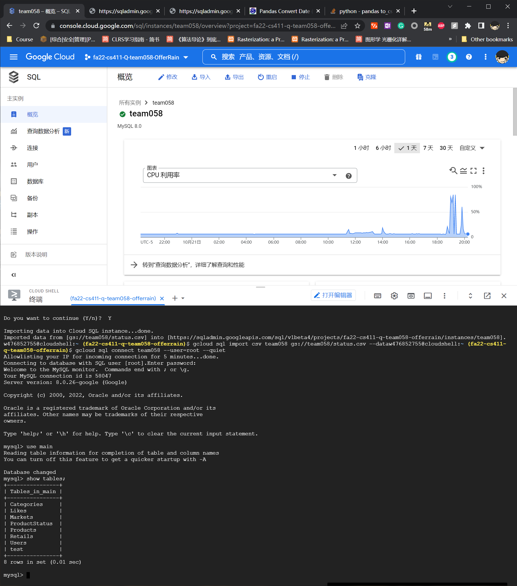
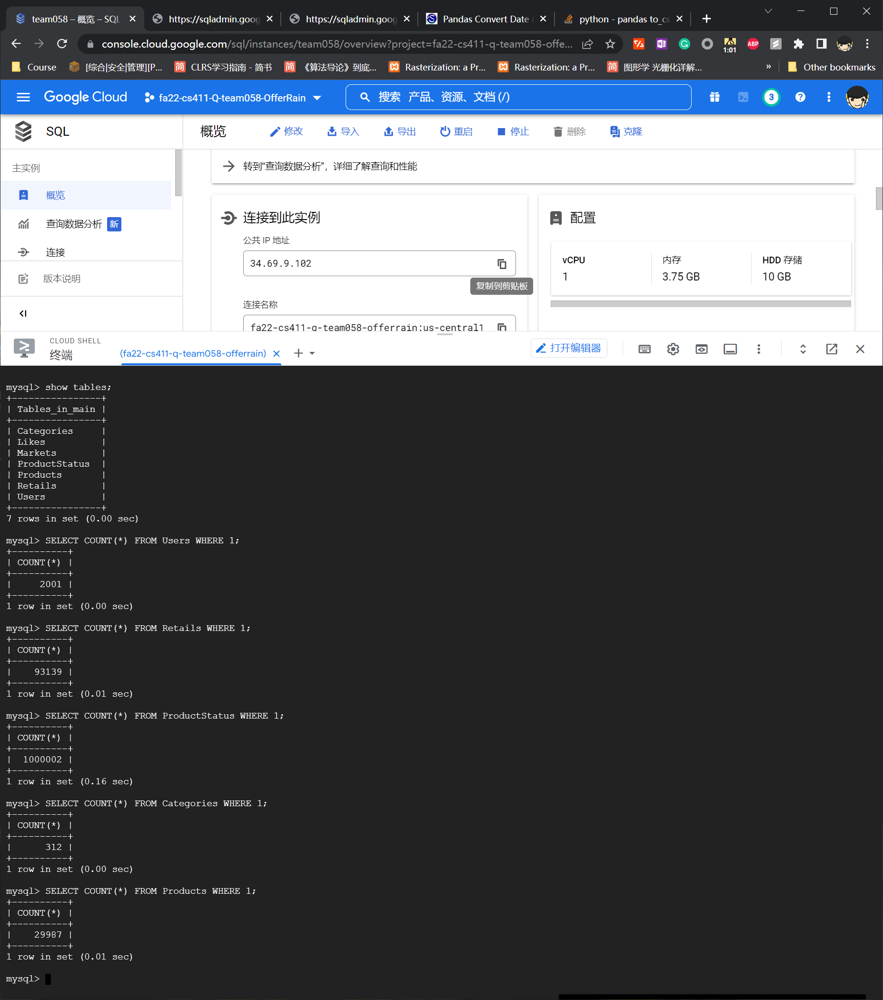
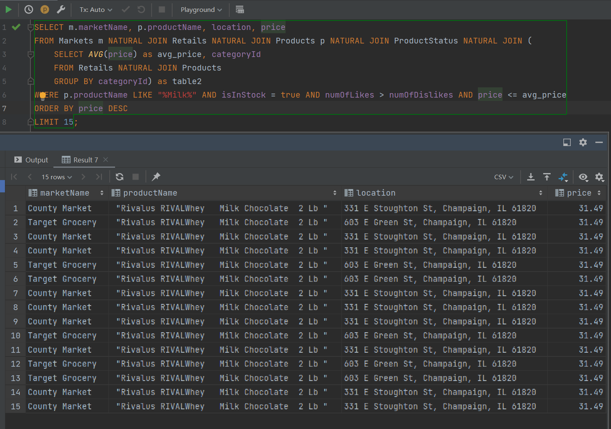
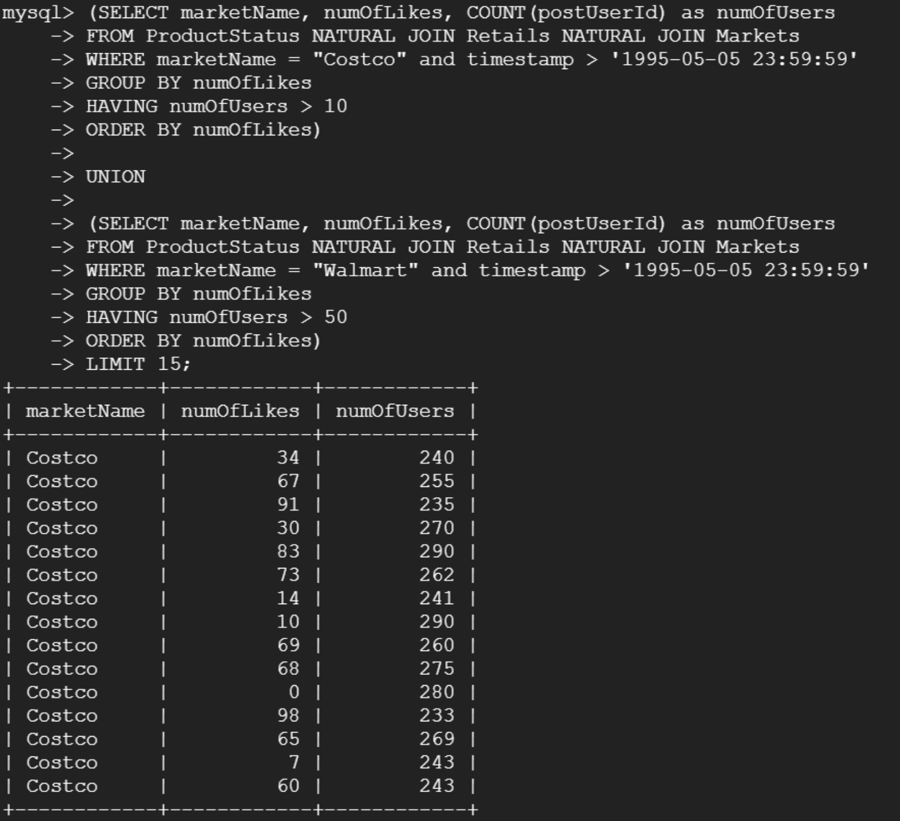

# Database Implementation

## Implementing the Database Tables on GCP
The figure shows the database on GCP



## DDL Commands for the table

Commands are also presented in the "../sql" dir

```sql
--  <-- Table Generation -->

DROP TABLE IF EXISTS Likes;
DROP TABLE IF EXISTS ProductStatus;
DROP TABLE IF EXISTS Retails;
DROP TABLE IF EXISTS Products;
DROP TABLE IF EXISTS Users;
DROP TABLE IF EXISTS Markets;
DROP TABLE IF EXISTS Categories;

CREATE TABLE Categories
(
    categoryId CHAR(32) PRIMARY KEY,
    level1     VARCHAR(32),
    level2     VARCHAR(32)
);

CREATE TABLE Markets
(
    marketId   CHAR(32) PRIMARY KEY,
    marketName VARCHAR(32),
    location   VARCHAR(64)
);

CREATE TABLE Users
(
    userId   CHAR(32) PRIMARY KEY,
    userName VARCHAR(32),
    email    VARCHAR(32),
    password CHAR(32)
);


CREATE TABLE Products
(
    productId   CHAR(32) PRIMARY KEY,
    categoryId  CHAR(32),
    productName VARCHAR(64),
    FOREIGN KEY (categoryId) REFERENCES Categories (categoryId)
);

CREATE TABLE Retails
(
    retailId  CHAR(32) PRIMARY KEY,
    marketId  CHAR(32),
    productId CHAR(32),
    price     REAL,
    FOREIGN KEY (marketId) REFERENCES Markets (marketId),
    FOREIGN KEY (productId) REFERENCES Products (productId)
);

CREATE TABLE ProductStatus
(
    statusId      CHAR(32) PRIMARY KEY,
    retailId      CHAR(32),
    postUserId    CHAR(32),
    timestamp     DATETIME,
    isInStock     BOOLEAN,
    numOfLikes    INT,
    numOfDislikes INT,
    FOREIGN KEY (retailId) REFERENCES Retails (retailId),
    FOREIGN KEY (postUserId) REFERENCES Users (userId)
);


CREATE TABLE Likes
(
    statusId  CHAR(32),
    userId    CHAR(32),
    sentiment BOOLEAN,
    FOREIGN KEY (statusId) REFERENCES ProductStatus (statusId),
    FOREIGN KEY (userId) REFERENCES Users (userId),
    PRIMARY KEY (statusId, userId)
);
```


## Inserting Rows




# Database Design

## Explain Analysis

### First we try on our advanced query *getPrice* with default option:
#### Query

This query is intended to find the available milk and the markets where they are listed with a price below average. 
MySQL by dafault create index for primary key and foreign key

```sql
EXPLAIN ANALYZE
SELECT m.marketName, p.productName, location, price
FROM Markets m NATURAL JOIN Retails NATURAL JOIN Products p NATURAL JOIN ProductStatus NATURAL JOIN (
    SELECT AVG(price) as avg_price, categoryId
    FROM Retails NATURAL JOIN Products
    GROUP BY categoryId) as table2
WHERE p.productName LIKE "%Milk%" AND isInStock = true AND numOfLikes > numOfDislikes AND price <= avg_price
ORDER BY price DESC;
```
#### Query Output



#### Default Index

And we get:

```sql
'-> Sort: Retails.price DESC  (actual time=544.496..544.997 rows=3552 loops=1)
    -> Stream results  (cost=47646.37 rows=10159) (actual time=456.025..541.807 rows=3552 loops=1)
        -> Nested loop inner join  (cost=47646.37 rows=10159) (actual time=456.017..539.838 rows=3552 loops=1)
            -> Nested loop inner join  (cost=36978.28 rows=2861) (actual time=0.172..75.000 rows=4972 loops=1)
                -> Nested loop inner join  (cost=35976.79 rows=2861) (actual time=0.165..72.326 rows=4972 loops=1)
                    -> Nested loop inner join  (cost=5928.95 rows=8381) (actual time=0.102..37.012 rows=675 loops=1)
                        -> Filter: ((p.productName like ''%Milk%'') and (p.categoryId is not null))  (cost=2995.45 rows=3194) (actual time=0.068..33.369 rows=220 loops=1)
                            -> Table scan on p  (cost=2995.45 rows=28747) (actual time=0.055..10.442 rows=29987 loops=1)
                        -> Filter: (Retails.marketId is not null)  (cost=0.66 rows=3) (actual time=0.014..0.016 rows=3 loops=220)
                            -> Index lookup on Retails using productId (productId=p.productId)  (cost=0.66 rows=3) (actual time=0.014..0.016 rows=3 loops=220)
                    -> Filter: ((ProductStatus.isInStock = true) and (ProductStatus.numOfLikes > ProductStatus.numOfDislikes))  (cost=2.56 rows=0) (actual time=0.044..0.052 rows=7 loops=675)
                        -> Index lookup on ProductStatus using retailId (retailId=Retails.retailId)  (cost=2.56 rows=10) (actual time=0.044..0.050 rows=11 loops=675)
                -> Single-row index lookup on m using PRIMARY (marketId=Retails.marketId)  (cost=0.25 rows=1) (actual time=0.000..0.000 rows=1 loops=4972)
            -> Filter: (Retails.price <= table2.avg_price)  (cost=31958.00..2.66 rows=4) (actual time=0.093..0.093 rows=1 loops=4972)
                -> Index lookup on table2 using <auto_key2> (categoryId=p.categoryId)  (actual time=0.001..0.001 rows=1 loops=4972)
                    -> Materialize  (cost=44487.69..44487.69 rows=75440) (actual time=461.526..462.709 rows=313 loops=1)
                        -> Group aggregate: avg(Retails.price)  (cost=36943.64 rows=75440) (actual time=0.420..454.885 rows=313 loops=1)
                            -> Nested loop inner join  (cost=29399.60 rows=75440) (actual time=0.042..398.926 rows=93139 loops=1)
                                -> Index scan on Products using categoryId  (cost=2995.45 rows=28747) (actual time=0.026..9.573 rows=29987 loops=1)
                                -> Index lookup on Retails using productId (productId=Products.productId)  (cost=0.66 rows=3) (actual time=0.012..0.013 rows=3 loops=29987)
'
```
in 0.594 sec.

#### Index Change: Add index on isInStock

Then we add index idx_instock to the table, we get results in 0.547 sec.

We believe the reason why adding the index only resulted in slight increase in speed is because the isInStock data is stored as a Boolean in the database. By implementing BTree, sorting on two values is not useful at all. The storage of the indices will be long linkedlists where iteration in the tree costs the same as directly iterating over the raw data. 

```sql
'-> Sort: Retails.price DESC  (actual time=531.449..531.948 rows=3552 loops=1)
    -> Stream results  (cost=92250.69 rows=50795) (actual time=446.577..528.607 rows=3552 loops=1)
        -> Nested loop inner join  (cost=92250.69 rows=50795) (actual time=446.567..526.624 rows=3552 loops=1)
            -> Nested loop inner join  (cost=38910.29 rows=14307) (actual time=0.163..70.876 rows=4972 loops=1)
                -> Nested loop inner join  (cost=8862.45 rows=8381) (actual time=0.105..37.811 rows=675 loops=1)
                    -> Nested loop inner join  (cost=5928.95 rows=8381) (actual time=0.099..36.594 rows=675 loops=1)
                        -> Filter: ((p.productName like ''%Milk%'') and (p.categoryId is not null))  (cost=2995.45 rows=3194) (actual time=0.070..33.078 rows=220 loops=1)
                            -> Table scan on p  (cost=2995.45 rows=28747) (actual time=0.058..10.365 rows=29987 loops=1)
                        -> Filter: (Retails.marketId is not null)  (cost=0.66 rows=3) (actual time=0.014..0.016 rows=3 loops=220)
                            -> Index lookup on Retails using productId (productId=p.productId)  (cost=0.66 rows=3) (actual time=0.014..0.015 rows=3 loops=220)
                    -> Single-row index lookup on m using PRIMARY (marketId=Retails.marketId)  (cost=0.25 rows=1) (actual time=0.002..0.002 rows=1 loops=675)
                -> Filter: ((ProductStatus.isInStock = true) and (ProductStatus.numOfLikes > ProductStatus.numOfDislikes))  (cost=2.56 rows=2) (actual time=0.041..0.048 rows=7 loops=675)
                    -> Index lookup on ProductStatus using retailId (retailId=Retails.retailId)  (cost=2.56 rows=10) (actual time=0.041..0.047 rows=11 loops=675)
            -> Filter: (Retails.price <= table2.avg_price)  (cost=31958.00..2.66 rows=4) (actual time=0.091..0.091 rows=1 loops=4972)
                -> Index lookup on table2 using <auto_key2> (categoryId=p.categoryId)  (actual time=0.001..0.001 rows=1 loops=4972)
                    -> Materialize  (cost=44487.69..44487.69 rows=75440) (actual time=452.484..453.636 rows=313 loops=1)
                        -> Group aggregate: avg(Retails.price)  (cost=36943.64 rows=75440) (actual time=0.359..445.468 rows=313 loops=1)
                            -> Nested loop inner join  (cost=29399.60 rows=75440) (actual time=0.038..389.934 rows=93139 loops=1)
                                -> Index scan on Products using categoryId  (cost=2995.45 rows=28747) (actual time=0.025..9.331 rows=29987 loops=1)
                                -> Index lookup on Retails using productId (productId=Products.productId)  (cost=0.66 rows=3) (actual time=0.011..0.012 rows=3 loops=29987)
'
```

#### Index Change: Add index on productName

Then we add index idx_productName to the table, we get results in 0.592 sec.

The generated log shows that the execution sequence of the commands are not changed after adding the indexes and thus they have nearly identical performance. ProductName is very random and mess and only several operations related to the ProductName. Thus, indexing it does not affect the sequence.

```sql
'-> Sort: Retails.price DESC  (actual time=543.643..544.131 rows=3552 loops=1)
    -> Stream results  (cost=47646.37 rows=10159) (actual time=454.990..540.954 rows=3552 loops=1)
        -> Nested loop inner join  (cost=47646.37 rows=10159) (actual time=454.982..538.919 rows=3552 loops=1)
            -> Nested loop inner join  (cost=36978.28 rows=2861) (actual time=0.174..74.256 rows=4972 loops=1)
                -> Nested loop inner join  (cost=35976.79 rows=2861) (actual time=0.166..71.502 rows=4972 loops=1)
                    -> Nested loop inner join  (cost=5928.95 rows=8381) (actual time=0.102..37.665 rows=675 loops=1)
                        -> Filter: ((p.productName like ''%Milk%'') and (p.categoryId is not null))  (cost=2995.45 rows=3194) (actual time=0.065..33.964 rows=220 loops=1)
                            -> Table scan on p  (cost=2995.45 rows=28747) (actual time=0.052..10.628 rows=29987 loops=1)
                        -> Filter: (Retails.marketId is not null)  (cost=0.66 rows=3) (actual time=0.015..0.016 rows=3 loops=220)
                            -> Index lookup on Retails using productId (productId=p.productId)  (cost=0.66 rows=3) (actual time=0.015..0.016 rows=3 loops=220)
                    -> Filter: ((ProductStatus.isInStock = true) and (ProductStatus.numOfLikes > ProductStatus.numOfDislikes))  (cost=2.56 rows=0) (actual time=0.043..0.050 rows=7 loops=675)
                        -> Index lookup on ProductStatus using retailId (retailId=Retails.retailId)  (cost=2.56 rows=10) (actual time=0.042..0.048 rows=11 loops=675)
                -> Single-row index lookup on m using PRIMARY (marketId=Retails.marketId)  (cost=0.25 rows=1) (actual time=0.000..0.000 rows=1 loops=4972)
            -> Filter: (Retails.price <= table2.avg_price)  (cost=31958.00..2.66 rows=4) (actual time=0.093..0.093 rows=1 loops=4972)
                -> Index lookup on table2 using <auto_key2> (categoryId=p.categoryId)  (actual time=0.001..0.001 rows=1 loops=4972)
                    -> Materialize  (cost=44487.69..44487.69 rows=75440) (actual time=461.331..462.563 rows=313 loops=1)
                        -> Group aggregate: avg(Retails.price)  (cost=36943.64 rows=75440) (actual time=0.383..453.852 rows=313 loops=1)
                            -> Nested loop inner join  (cost=29399.60 rows=75440) (actual time=0.039..397.047 rows=93139 loops=1)
                                -> Index scan on Products using categoryId  (cost=2995.45 rows=28747) (actual time=0.025..9.324 rows=29987 loops=1)
                                -> Index lookup on Retails using productId (productId=Products.productId)  (cost=0.66 rows=3) (actual time=0.011..0.013 rows=3 loops=29987)
'
```

#### Index Change: Add index on price

Then we add index idx_price to the table, we get results in 0.562 sec.

The addition of index increased the runtime by 30ms. An expensive part of this query is to find the average price which has to be calculated by iterating over all the prices, and index will not improve it. However, when finding the prices larger than the average price, the index can improve it. That is where that 30ms came from.

```sql
'-> Sort: Retails.price DESC  (actual time=547.244..547.743 rows=3552 loops=1)
    -> Stream results  (cost=47646.37 rows=10159) (actual time=459.053..544.568 rows=3552 loops=1)
        -> Nested loop inner join  (cost=47646.37 rows=10159) (actual time=459.045..542.588 rows=3552 loops=1)
            -> Nested loop inner join  (cost=36978.28 rows=2861) (actual time=0.189..74.669 rows=4972 loops=1)
                -> Nested loop inner join  (cost=35976.79 rows=2861) (actual time=0.183..71.716 rows=4972 loops=1)
                    -> Nested loop inner join  (cost=5928.95 rows=8381) (actual time=0.123..38.163 rows=675 loops=1)
                        -> Filter: ((p.productName like ''%Milk%'') and (p.categoryId is not null))  (cost=2995.45 rows=3194) (actual time=0.070..34.458 rows=220 loops=1)
                            -> Table scan on p  (cost=2995.45 rows=28747) (actual time=0.056..10.627 rows=29987 loops=1)
                        -> Filter: (Retails.marketId is not null)  (cost=0.66 rows=3) (actual time=0.015..0.016 rows=3 loops=220)
                            -> Index lookup on Retails using productId (productId=p.productId)  (cost=0.66 rows=3) (actual time=0.014..0.016 rows=3 loops=220)
                    -> Filter: ((ProductStatus.isInStock = true) and (ProductStatus.numOfLikes > ProductStatus.numOfDislikes))  (cost=2.56 rows=0) (actual time=0.042..0.049 rows=7 loops=675)
                        -> Index lookup on ProductStatus using retailId (retailId=Retails.retailId)  (cost=2.56 rows=10) (actual time=0.042..0.047 rows=11 loops=675)
                -> Single-row index lookup on m using PRIMARY (marketId=Retails.marketId)  (cost=0.25 rows=1) (actual time=0.000..0.000 rows=1 loops=4972)
            -> Filter: (Retails.price <= table2.avg_price)  (cost=31958.00..2.66 rows=4) (actual time=0.094..0.094 rows=1 loops=4972)
                -> Index lookup on table2 using <auto_key2> (categoryId=p.categoryId)  (actual time=0.001..0.001 rows=1 loops=4972)
                    -> Materialize  (cost=44487.69..44487.69 rows=75440) (actual time=464.627..465.810 rows=313 loops=1)
                        -> Group aggregate: avg(Retails.price)  (cost=36943.64 rows=75440) (actual time=0.365..457.895 rows=313 loops=1)
                            -> Nested loop inner join  (cost=29399.60 rows=75440) (actual time=0.042..400.477 rows=93139 loops=1)
                                -> Index scan on Products using categoryId  (cost=2995.45 rows=28747) (actual time=0.027..9.200 rows=29987 loops=1)
                                -> Index lookup on Retails using productId (productId=Products.productId)  (cost=0.66 rows=3) (actual time=0.012..0.013 rows=3 loops=29987)
'
```


### Second query:
#### Query
This query is intended to find the products sold in Costco and Walmart in the last 30 years where their comments about the availability is more than certain number.
```sql
(
SELECT marketName, numOfLikes, COUNT(postUserId) as numOfUsers
FROM ProductStatus NATURAL JOIN Retails NATURAL JOIN Markets
WHERE marketName = "Costco" and timestamp > '1995-05-05 23:59:59'
GROUP BY numOfLikes
HAVING numOfUsers > 10
ORDER BY numOfLikes)

UNION

(SELECT marketName, numOfLikes, COUNT(postUserId) as numOfUsers
FROM ProductStatus NATURAL JOIN Retails NATURAL JOIN Markets
WHERE marketName = "Walmart" and timestamp > '1995-05-05 23:59:59'
GROUP BY numOfLikes
HAVING numOfUsers > 50
ORDER BY numOfLikes);
```
#### Query Output:



#### Default Index
```sql
'-> Table scan on <union temporary>  (cost=2.50..2.50 rows=0) (actual time=0.000..0.017 rows=200 loops=1)
    -> Union materialize with deduplication  (cost=2.50..2.50 rows=0) (actual time=1115.089..1115.117 rows=200 loops=1)
        -> Filter: (numOfUsers > 10)  (actual time=560.303..560.328 rows=100 loops=1)
            -> Table scan on <temporary>  (actual time=0.001..0.012 rows=100 loops=1)
                -> Aggregate using temporary table  (actual time=560.300..560.317 rows=100 loops=1)
                    -> Nested loop inner join  (cost=77924.97 rows=72039) (actual time=0.218..543.630 rows=26000 loops=1)
                        -> Nested loop inner join  (cost=2275.97 rows=21101) (actual time=0.116..11.474 rows=12113 loops=1)
                            -> Filter: (Markets.marketName = ''Costco'')  (cost=0.75 rows=1) (actual time=0.028..0.039 rows=1 loops=1)
                                -> Table scan on Markets  (cost=0.75 rows=5) (actual time=0.023..0.031 rows=5 loops=1)
                            -> Index lookup on Retails using marketId (marketId=Markets.marketId)  (cost=2275.22 rows=21101) (actual time=0.087..10.654 rows=12113 loops=1)
                        -> Filter: (ProductStatus.`timestamp` > TIMESTAMP''1995-05-05 23:59:59'')  (cost=2.56 rows=3) (actual time=0.039..0.044 rows=2 loops=12113)
                            -> Index lookup on ProductStatus using retailId (retailId=Retails.retailId)  (cost=2.56 rows=10) (actual time=0.038..0.043 rows=11 loops=12113)
        -> Filter: (numOfUsers > 50)  (actual time=554.622..554.647 rows=100 loops=1)
            -> Table scan on <temporary>  (actual time=0.001..0.012 rows=101 loops=1)
                -> Aggregate using temporary table  (actual time=554.619..554.635 rows=101 loops=1)
                    -> Nested loop inner join  (cost=77924.97 rows=72039) (actual time=0.148..537.518 rows=26027 loops=1)
                        -> Nested loop inner join  (cost=2275.97 rows=21101) (actual time=0.098..11.571 rows=11958 loops=1)
                            -> Filter: (Markets.marketName = ''Walmart'')  (cost=0.75 rows=1) (actual time=0.013..0.023 rows=1 loops=1)
                                -> Table scan on Markets  (cost=0.75 rows=5) (actual time=0.011..0.018 rows=5 loops=1)
                            -> Index lookup on Retails using marketId (marketId=Markets.marketId)  (cost=2275.22 rows=21101) (actual time=0.084..10.784 rows=11958 loops=1)
                        -> Filter: (ProductStatus.`timestamp` > TIMESTAMP''1995-05-05 23:59:59'')  (cost=2.56 rows=3) (actual time=0.039..0.044 rows=2 loops=11958)
                            -> Index lookup on ProductStatus using retailId (retailId=Retails.retailId)  (cost=2.56 rows=10) (actual time=0.038..0.043 rows=11 loops=11958)
'
```
in 1.141 sec.

#### Index Change: Add index on numOfLikes and timestamp

we get results in 1.125 sec.

Add index on numOfLikes and timestamp does not introduce improvement. It might because the execution mainly focus on the attributes that are primary and foreign keys and thus adding other keys does not affect the performance of the execution. Meanwhile, the number of rows affected by the timestamp is very small during the filtering phrase as presented in the following log and therefore indexing it would not improve the performance. 

```sql
'-> Table scan on <union temporary>  (cost=2.50..2.50 rows=0) (actual time=0.000..0.016 rows=200 loops=1)
    -> Union materialize with deduplication  (cost=2.50..2.50 rows=0) (actual time=1105.538..1105.564 rows=200 loops=1)
        -> Filter: (numOfUsers > 10)  (actual time=563.608..563.633 rows=100 loops=1)
            -> Table scan on <temporary>  (actual time=0.001..0.013 rows=100 loops=1)
                -> Aggregate using temporary table  (actual time=563.605..563.622 rows=100 loops=1)
                    -> Nested loop inner join  (cost=77924.97 rows=96016) (actual time=0.232..547.207 rows=26000 loops=1)
                        -> Nested loop inner join  (cost=2275.97 rows=21101) (actual time=0.116..11.321 rows=12113 loops=1)
                            -> Filter: (Markets.marketName = ''Costco'')  (cost=0.75 rows=1) (actual time=0.025..0.042 rows=1 loops=1)
                                -> Table scan on Markets  (cost=0.75 rows=5) (actual time=0.019..0.026 rows=5 loops=1)
                            -> Index lookup on Retails using marketId (marketId=Markets.marketId)  (cost=2275.22 rows=21101) (actual time=0.090..10.540 rows=12113 loops=1)
                        -> Filter: (ProductStatus.`timestamp` > TIMESTAMP''1995-05-05 23:59:59'')  (cost=2.56 rows=5) (actual time=0.039..0.044 rows=2 loops=12113)
                            -> Index lookup on ProductStatus using retailId (retailId=Retails.retailId)  (cost=2.56 rows=10) (actual time=0.038..0.043 rows=11 loops=12113)
        -> Filter: (numOfUsers > 50)  (actual time=541.769..541.794 rows=100 loops=1)
            -> Table scan on <temporary>  (actual time=0.001..0.013 rows=101 loops=1)
                -> Aggregate using temporary table  (actual time=541.765..541.783 rows=101 loops=1)
                    -> Nested loop inner join  (cost=77924.97 rows=96016) (actual time=0.155..525.447 rows=26027 loops=1)
                        -> Nested loop inner join  (cost=2275.97 rows=21101) (actual time=0.100..11.216 rows=11958 loops=1)
                            -> Filter: (Markets.marketName = ''Walmart'')  (cost=0.75 rows=1) (actual time=0.013..0.025 rows=1 loops=1)
                                -> Table scan on Markets  (cost=0.75 rows=5) (actual time=0.012..0.019 rows=5 loops=1)
                            -> Index lookup on Retails using marketId (marketId=Markets.marketId)  (cost=2275.22 rows=21101) (actual time=0.086..10.457 rows=11958 loops=1)
                        -> Filter: (ProductStatus.`timestamp` > TIMESTAMP''1995-05-05 23:59:59'')  (cost=2.56 rows=5) (actual time=0.038..0.043 rows=2 loops=11958)
                            -> Index lookup on ProductStatus using retailId (retailId=Retails.retailId)  (cost=2.56 rows=10) (actual time=0.037..0.042 rows=11 loops=11958)
'
```

#### Index Change: Add index on numOfLikes only

We get results in 1.172 sec

The generated log shows that the execution sequence of the commands are not changed after adding the indexes and thus they have nearly identical performance. Because every numOfLikes will be scanned through the query and thus it is less meaningful to index it. Meanwhile, it might be possible that the MySQL engine optimize the query since there are many primary keys and foreign keys involved in the query and they are more important (they are accessed more).

```sql
'-> Table scan on <union temporary>  (cost=2.50..2.50 rows=0) (actual time=0.001..0.018 rows=200 loops=1)
    -> Union materialize with deduplication  (cost=2.50..2.50 rows=0) (actual time=1160.804..1160.833 rows=200 loops=1)
        -> Filter: (numOfUsers > 10)  (actual time=590.164..590.190 rows=100 loops=1)
            -> Table scan on <temporary>  (actual time=0.001..0.013 rows=100 loops=1)
                -> Aggregate using temporary table  (actual time=590.161..590.179 rows=100 loops=1)
                    -> Nested loop inner join  (cost=77924.97 rows=72039) (actual time=0.190..571.754 rows=26000 loops=1)
                        -> Nested loop inner join  (cost=2275.97 rows=21101) (actual time=0.113..12.026 rows=12113 loops=1)
                            -> Filter: (Markets.marketName = ''Costco'')  (cost=0.75 rows=1) (actual time=0.022..0.033 rows=1 loops=1)
                                -> Table scan on Markets  (cost=0.75 rows=5) (actual time=0.017..0.025 rows=5 loops=1)
                            -> Index lookup on Retails using marketId (marketId=Markets.marketId)  (cost=2275.22 rows=21101) (actual time=0.091..11.208 rows=12113 loops=1)
                        -> Filter: (ProductStatus.`timestamp` > TIMESTAMP''1995-05-05 23:59:59'')  (cost=2.56 rows=3) (actual time=0.041..0.046 rows=2 loops=12113)
                            -> Index lookup on ProductStatus using retailId (retailId=Retails.retailId)  (cost=2.56 rows=10) (actual time=0.040..0.045 rows=11 loops=12113)
        -> Filter: (numOfUsers > 50)  (actual time=570.460..570.491 rows=100 loops=1)
            -> Table scan on <temporary>  (actual time=0.002..0.014 rows=101 loops=1)
                -> Aggregate using temporary table  (actual time=570.456..570.474 rows=101 loops=1)
                    -> Nested loop inner join  (cost=77924.97 rows=72039) (actual time=0.156..552.402 rows=26027 loops=1)
                        -> Nested loop inner join  (cost=2275.97 rows=21101) (actual time=0.104..11.605 rows=11958 loops=1)
                            -> Filter: (Markets.marketName = ''Walmart'')  (cost=0.75 rows=1) (actual time=0.016..0.027 rows=1 loops=1)
                                -> Table scan on Markets  (cost=0.75 rows=5) (actual time=0.014..0.022 rows=5 loops=1)
                            -> Index lookup on Retails using marketId (marketId=Markets.marketId)  (cost=2275.22 rows=21101) (actual time=0.087..10.832 rows=11958 loops=1)
                        -> Filter: (ProductStatus.`timestamp` > TIMESTAMP''1995-05-05 23:59:59'')  (cost=2.56 rows=3) (actual time=0.040..0.045 rows=2 loops=11958)
                            -> Index lookup on ProductStatus using retailId (retailId=Retails.retailId)  (cost=2.56 rows=10) (actual time=0.039..0.044 rows=11 loops=11958)
'
```
#### Index Change: Add index on marketName

The reason why adding index to marketName only slightly improves the efficiecy is because we only stored 5 market names in the database. Using BTree or not will barely affect the outcome. However, we believe the advantage of the index will grow significantly once the database gets larger.

we get results in 1.219 sec.

```sql
'-> Table scan on <union temporary>  (cost=2.50..2.50 rows=0) (actual time=0.001..0.016 rows=200 loops=1)
    -> Union materialize with deduplication  (cost=2.50..2.50 rows=0) (actual time=1194.038..1194.064 rows=200 loops=1)
        -> Filter: (numOfUsers > 10)  (actual time=606.427..606.475 rows=100 loops=1)
            -> Table scan on <temporary>  (actual time=0.002..0.016 rows=100 loops=1)
                -> Aggregate using temporary table  (actual time=606.424..606.444 rows=100 loops=1)
                    -> Nested loop inner join  (cost=77924.56 rows=72039) (actual time=0.167..585.241 rows=26000 loops=1)
                        -> Nested loop inner join  (cost=2275.57 rows=21101) (actual time=0.101..12.657 rows=12113 loops=1)
                            -> Index lookup on Markets using idx_mkname (marketName=''Costco'')  (cost=0.35 rows=1) (actual time=0.015..0.019 rows=1 loops=1)
                            -> Index lookup on Retails using marketId (marketId=Markets.marketId)  (cost=2275.22 rows=21101) (actual time=0.085..11.778 rows=12113 loops=1)
                        -> Filter: (ProductStatus.`timestamp` > TIMESTAMP''1995-05-05 23:59:59'')  (cost=2.56 rows=3) (actual time=0.042..0.047 rows=2 loops=12113)
                            -> Index lookup on ProductStatus using retailId (retailId=Retails.retailId)  (cost=2.56 rows=10) (actual time=0.041..0.046 rows=11 loops=12113)
        -> Filter: (numOfUsers > 50)  (actual time=587.422..587.448 rows=100 loops=1)
            -> Table scan on <temporary>  (actual time=0.002..0.013 rows=101 loops=1)
                -> Aggregate using temporary table  (actual time=587.417..587.434 rows=101 loops=1)
                    -> Nested loop inner join  (cost=77924.56 rows=72039) (actual time=0.180..567.267 rows=26027 loops=1)
                        -> Nested loop inner join  (cost=2275.57 rows=21101) (actual time=0.113..12.012 rows=11958 loops=1)
                            -> Index lookup on Markets using idx_mkname (marketName=''Walmart'')  (cost=0.35 rows=1) (actual time=0.024..0.029 rows=1 loops=1)
                            -> Index lookup on Retails using marketId (marketId=Markets.marketId)  (cost=2275.22 rows=21101) (actual time=0.088..11.187 rows=11958 loops=1)
                        -> Filter: (ProductStatus.`timestamp` > TIMESTAMP''1995-05-05 23:59:59'')  (cost=2.56 rows=3) (actual time=0.041..0.046 rows=2 loops=11958)
                            -> Index lookup on ProductStatus using retailId (retailId=Retails.retailId)  (cost=2.56 rows=10) (actual time=0.040..0.045 rows=11 loops=11958)
'
```

### Third query:
#### Query
```sql
EXPLAIN ANALYZE
SELECT productName
FROM Products
WHERE productId IN (
        SELECT productId
        FROM Markets NATURAL JOIN Retails NATURAL JOIN Products
        WHERE marketName = "Walmart")

UNION

SELECT productName
FROM Products
WHERE productId NOT IN (
        SELECT productId
        FROM Markets NATURAL JOIN Retails NATURAL JOIN Products
        WHERE marketName = "Target")

ORDER BY productName;
```
and we get:
```sql
'-> Sort: productName  (cost=2.50 rows=0) (actual time=42.079..44.477 rows=29430 loops=1)
    -> Table scan on <union temporary>  (cost=2.50 rows=0) (actual time=0.002..2.623 rows=29430 loops=1)
        -> Union materialize with deduplication  (cost=25849.78..25852.28 rows=49848) (actual time=213.772..217.854 rows=29430 loops=1)
            -> Remove duplicate (Products, Products) rows using temporary table (weedout)  (cost=17869.50 rows=21101) (actual time=0.356..110.298 rows=11916 loops=1)
                -> Nested loop inner join  (cost=17869.50 rows=21101) (actual time=0.350..87.210 rows=11958 loops=1)
                    -> Nested loop inner join  (cost=10484.06 rows=21101) (actual time=0.346..66.725 rows=11958 loops=1)
                        -> Nested loop inner join  (cost=3098.63 rows=21101) (actual time=0.338..37.782 rows=11958 loops=1)
                            -> Filter: (Markets.marketName = ''Walmart'')  (cost=0.75 rows=1) (actual time=0.041..0.059 rows=1 loops=1)
                                -> Table scan on Markets  (cost=0.75 rows=5) (actual time=0.036..0.044 rows=5 loops=1)
                            -> Filter: (Retails.productId is not null)  (cost=3097.87 rows=21101) (actual time=0.297..36.790 rows=11958 loops=1)
                                -> Index lookup on Retails using marketId (marketId=Markets.marketId)  (cost=3097.87 rows=21101) (actual time=0.296..35.396 rows=11958 loops=1)
                        -> Single-row index lookup on Products using PRIMARY (productId=Retails.productId)  (cost=0.25 rows=1) (actual time=0.002..0.002 rows=1 loops=11958)
                    -> Single-row index lookup on Products using PRIMARY (productId=Retails.productId)  (cost=0.25 rows=1) (actual time=0.001..0.002 rows=1 loops=11958)
            -> Filter: <in_optimizer>(Products.productId,Products.productId in (select #4) is false)  (cost=2995.45 rows=28747) (actual time=0.064..16.782 rows=29987 loops=1)
                -> Table scan on Products  (cost=2995.45 rows=28747) (actual time=0.038..9.291 rows=29987 loops=1)
                -> Select #4 (subquery in condition; run only once)
                    -> Filter: ((Products.productId = `<materialized_subquery>`.productId))  (actual time=0.001..0.001 rows=0 loops=1)
                        -> Limit: 1 row(s)  (actual time=0.001..0.001 rows=0 loops=1)
                            -> Index lookup on <materialized_subquery> using <auto_distinct_key> (productId=Products.productId)  (actual time=0.000..0.000 rows=0 loops=1)
                                -> Materialize with deduplication  (cost=12594.19..12594.19 rows=21101) (actual time=0.016..0.016 rows=0 loops=1)
                                    -> Nested loop inner join  (cost=10484.06 rows=21101) (actual time=0.011..0.011 rows=0 loops=1)
                                        -> Nested loop inner join  (cost=3098.63 rows=21101) (actual time=0.010..0.010 rows=0 loops=1)
                                            -> Filter: (Markets.marketName = ''Target'')  (cost=0.75 rows=1) (actual time=0.010..0.010 rows=0 loops=1)
                                                -> Table scan on Markets  (cost=0.75 rows=5) (actual time=0.008..0.009 rows=5 loops=1)
                                            -> Filter: (Retails.productId is not null)  (cost=3097.87 rows=21101) (never executed)
                                                -> Index lookup on Retails using marketId (marketId=Markets.marketId)  (cost=3097.87 rows=21101) (never executed)
                                        -> Single-row index lookup on Products using PRIMARY (productId=Retails.productId)  (cost=0.25 rows=1) (never executed)
'
```
in 0.235 sec

#### Index Change: Add index marketName

The reason why adding index to marketName only slightly improves the efficiecy is because we only stored 5 market names in the database. Using BTree or not will barely affect the outcome. However, we believe the advantage of the index will grow significantly once the database gets larger.

We get result in 0.219 sec
```sql
'-> Sort: productName  (cost=2.50 rows=0) (actual time=38.287..40.928 rows=29430 loops=1)
    -> Table scan on <union temporary>  (cost=2.50 rows=0) (actual time=0.002..2.583 rows=29430 loops=1)
        -> Union materialize with deduplication  (cost=25849.38..25851.88 rows=49848) (actual time=192.014..196.324 rows=29430 loops=1)
            -> Remove duplicate (Products, Products) rows using temporary table (weedout)  (cost=17869.10 rows=21101) (actual time=0.349..95.239 rows=11916 loops=1)
                -> Nested loop inner join  (cost=17869.10 rows=21101) (actual time=0.342..75.479 rows=11958 loops=1)
                    -> Nested loop inner join  (cost=10483.66 rows=21101) (actual time=0.339..57.489 rows=11958 loops=1)
                        -> Nested loop inner join  (cost=3098.22 rows=21101) (actual time=0.332..32.582 rows=11958 loops=1)
                            -> Index lookup on Markets using idx_mkname (marketName=''Walmart'')  (cost=0.35 rows=1) (actual time=0.015..0.020 rows=1 loops=1)
                            -> Filter: (Retails.productId is not null)  (cost=3097.88 rows=21101) (actual time=0.315..31.673 rows=11958 loops=1)
                                -> Index lookup on Retails using marketId (marketId=Markets.marketId)  (cost=3097.88 rows=21101) (actual time=0.315..30.510 rows=11958 loops=1)
                        -> Single-row index lookup on Products using PRIMARY (productId=Retails.productId)  (cost=0.25 rows=1) (actual time=0.002..0.002 rows=1 loops=11958)
                    -> Single-row index lookup on Products using PRIMARY (productId=Retails.productId)  (cost=0.25 rows=1) (actual time=0.001..0.001 rows=1 loops=11958)
            -> Filter: <in_optimizer>(Products.productId,Products.productId in (select #4) is false)  (cost=2995.45 rows=28747) (actual time=0.062..17.176 rows=29987 loops=1)
                -> Table scan on Products  (cost=2995.45 rows=28747) (actual time=0.038..9.435 rows=29987 loops=1)
                -> Select #4 (subquery in condition; run only once)
                    -> Filter: ((Products.productId = `<materialized_subquery>`.productId))  (actual time=0.001..0.001 rows=0 loops=1)
                        -> Limit: 1 row(s)  (actual time=0.001..0.001 rows=0 loops=1)
                            -> Index lookup on <materialized_subquery> using <auto_distinct_key> (productId=Products.productId)  (actual time=0.000..0.000 rows=0 loops=1)
                                -> Materialize with deduplication  (cost=12593.79..12593.79 rows=21101) (actual time=0.014..0.014 rows=0 loops=1)
                                    -> Nested loop inner join  (cost=10483.66 rows=21101) (actual time=0.009..0.009 rows=0 loops=1)
                                        -> Nested loop inner join  (cost=3098.22 rows=21101) (actual time=0.008..0.008 rows=0 loops=1)
                                            -> Index lookup on Markets using idx_mkname (marketName=''Target'')  (cost=0.35 rows=1) (actual time=0.008..0.008 rows=0 loops=1)
                                            -> Filter: (Retails.productId is not null)  (cost=3097.88 rows=21101) (never executed)
                                                -> Index lookup on Retails using marketId (marketId=Markets.marketId)  (cost=3097.88 rows=21101) (never executed)
                                        -> Single-row index lookup on Products using PRIMARY (productId=Retails.productId)  (cost=0.25 rows=1) (never executed)
'
```


